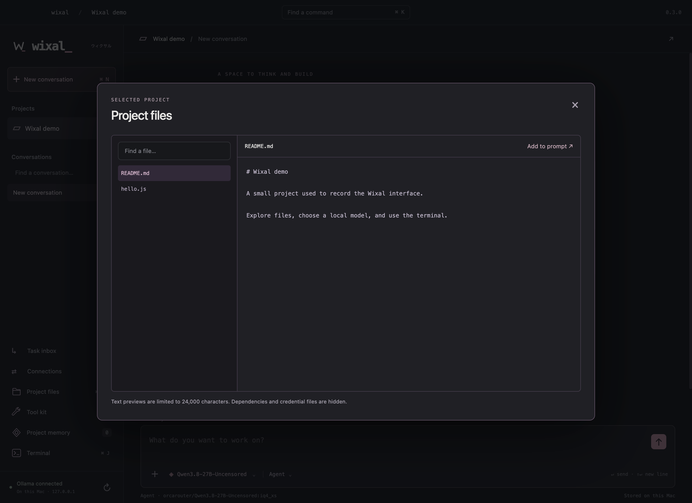
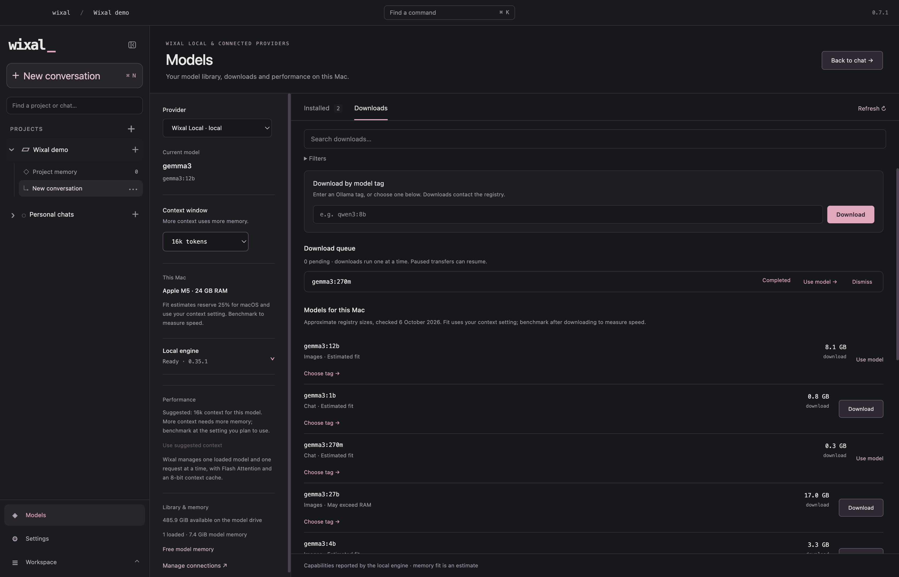

  <picture>
    <source media="(prefers-reduced-motion: reduce)" srcset="assets/motion/logo-reveal-still.png">
    
  </picture>

<h3 align="center">A local AI workspace for your Mac.</h3>

  Chat with local models. Work on your project files. Review what the agent does. 
  Files, tools, memory and a terminal — together in one desktop app.

  <a href="https://github.com/TheJhyeFactor/Wixal/releases/download/v0.7.9/Wixal-0.7.9-macOS-arm64.dmg"><strong>Download for Mac ↓</strong></a> &nbsp;·&nbsp;
  <a href="#see-wixal-in-action">Watch the demo</a> &nbsp;·&nbsp;
  <a href="docs/user-guide.md">User guide</a> &nbsp;·&nbsp;
  <a href="https://github.com/TheJhyeFactor/Wixal/releases/tag/v0.7.9">Release notes</a>
   
  v0.7.9 &nbsp;·&nbsp; Apple Silicon &nbsp;·&nbsp; macOS 14+

  <a href="#work-on-your-project">Project work</a> &nbsp;/&nbsp;
  <a href="#run-models-on-your-mac">Local models</a> &nbsp;/&nbsp;
  <a href="#keep-your-project-context">Memory</a> &nbsp;/&nbsp;
  <a href="#connect-the-tools-you-need">Tools</a> &nbsp;/&nbsp;
  <a href="#get-started">Get started</a>

---

## See Wixal in action

From choosing a model to opening project files, reviewing tools and working in the terminal.

  <picture>
    <source media="(prefers-reduced-motion: reduce)" srcset="docs/screenshots/workspace.png">
    
  </picture>
   
  Recorded in Wixal 0.7.3. The current download is 0.7.9.

## Work on your project

Open a folder and give the model the context it needs. Read and search files, review exact edits, create directories and run commands with visible output. Use **Chat** for a conversation or **Agent** to work through a task.

Choose **Review each action** to inspect tool requests before they run, or **Approved all** for enabled tools in a workspace you trust. Stop a running task when you need to.

[Project tools and workflows →](docs/tool-workflows.md)

## Run models on your Mac

Download a model inside Wixal or import weights already installed in Ollama. **Wixal Local**, the included engine, runs inference on your Mac. Choose a model marked **Tools** when you want it to use the workspace tools.

No separate Ollama server is required. Model publisher names, licences and capability badges remain visible. Performance depends on your model and Mac.

[Models and performance →](docs/performance.md) · [The included local engine →](docs/local-runtime.md)

## Keep your project context

Save project notes, recall earlier active project chats and carry a visible summary into a fresh conversation. Switch local models in the same chat while retaining readable evidence of earlier work.

Choose project-only memory, add a small global preference profile, or turn memory off. The optional global profile is editable and limited to 1,200 characters. Guest profiles stay on this Mac; verified account profiles sync explicitly through Firebase.

[Memory, context and model switching →](docs/memory.md)

## Connect the tools you need

| Use Wixal to… | Available in the published app |
| :--- | :--- |
| **Work with files and commands** | Search project files, review edits and run commands with output, exit status and cancellation. |
| **Explore the web** | Search with source links, read rendered pages and review navigation, clicks and ordinary form controls in isolated browser sessions. |
| **Call APIs** | Read HTTP responses or review JSON writes, with visible results and pagination. |
| **Add external tools** | Connect trusted local MCP servers and choose which tools the model can call. |
| **Assess authorised targets** | Run eight Nmap assessment profiles, cancel jobs and save results as evidence. |
| **Use a terminal** | Open a zsh terminal beside your project and conversation. |

Built-in tools are available without MCP setup. Enable the tools you need in the workspace header, or request a particular tool with **@tool_name**. Browser tools support reviewed browsing and ordinary controls; authenticated computer use has additional limits.

Inference, chats and project notes stay local. Web and MCP tools contact their configured services. Enabled shell commands run with your Mac user’s access.

[Feature guide →](docs/features.md) · [Tool limits →](docs/tool-workflows.md) · [Assessment profiles →](docs/cyber-tools.md)

## Get started

1. **Install Wixal.** [Download the DMG](https://github.com/TheJhyeFactor/Wixal/releases/download/v0.7.9/Wixal-0.7.9-macOS-arm64.dmg) and drag **Wixal.app** into **Applications**. A [ZIP download](https://github.com/TheJhyeFactor/Wixal/releases/download/v0.7.9/Wixal-0.7.9-macOS-arm64.zip) is also available.
2. **Choose a local model.** Open **Models** and download a model, or select **Import & use** for existing Ollama weights.
3. **Open your project.** Press **⌘O** to choose a folder and **⌘L** to choose a model. Start chatting, or select **Agent** for a task.

Start as a guest or use an optional Wixal account. Local projects, chats, models, memory and tools are available to guests. Verified accounts can explicitly save workspace presets; see [account setup and privacy](docs/accounts.md).

**Installation note:** the preview is not Developer ID signed or notarised. If macOS blocks the first launch, follow the [release installation notes](https://github.com/TheJhyeFactor/Wixal/releases/tag/v0.7.9#install).

## Release and native preview

**The download above is the Electron 0.7.9 app.** It includes the local engine, project tools, browser workflows, memory, accounts and terminal described here. [Read the release notes →](docs/release-0.7.9.md)

A separate **SwiftUI/AppKit app with a Python agent engine** is under development in [`native/`](native/README.md). Its semantic memory, reviewed memory suggestions, encrypted folder sync, remote HTTP MCP, awake closed-app schedules and interactive WebKit features require the native preview. They are not included in the published Electron downloads. The native preview is Apple Silicon macOS-only and development-signed.

<strong>Native preview status and remaining work</strong>

See the [implementation status](native/IMPLEMENTATION_STATUS_2026-10-07.md) for verification evidence and the [remaining review](native/REMAINING_REVIEW.md) for limitations. Follow-up work includes fresh account creation/verification, exhaustive VoiceOver and minimum-size coverage, external OAuth providers, two-device cloud-folder delivery, sleeping-Mac wake, other platforms, comparative app performance and Developer ID/notarised distribution. Cloud inference and the external ChatGPT companion remain deferred.

## Explore further

| Looking for… | Start here |
| :--- | :--- |
| Everyday use | [User guide](docs/user-guide.md) · [Feature guide](docs/features.md) |
| Memory and tools | [Memory](docs/memory.md) · [Tool workflows](docs/tool-workflows.md) · [MCP setup](docs/features.md#external-mcp-tools) |
| Building or contributing | [Development](docs/development.md) · [Architecture](docs/architecture.md) · [Contributing](CONTRIBUTING.md) |
| Native development | [Native README](native/README.md) · [Implementation status](native/IMPLEMENTATION_STATUS_2026-10-07.md) |
| Bugs and ideas | [Report an issue](https://github.com/TheJhyeFactor/Wixal/issues) |
| Releases and artwork | [Changelog](CHANGELOG.md) · [Logo and motion](docs/visuals.md) · [Screenshots](docs/screenshots) |

Wixal Local uses pinned open-source Ollama 0.35.1. Upstream engine and model publisher licences are retained. [Third-party notices](THIRD_PARTY_NOTICES.md).
