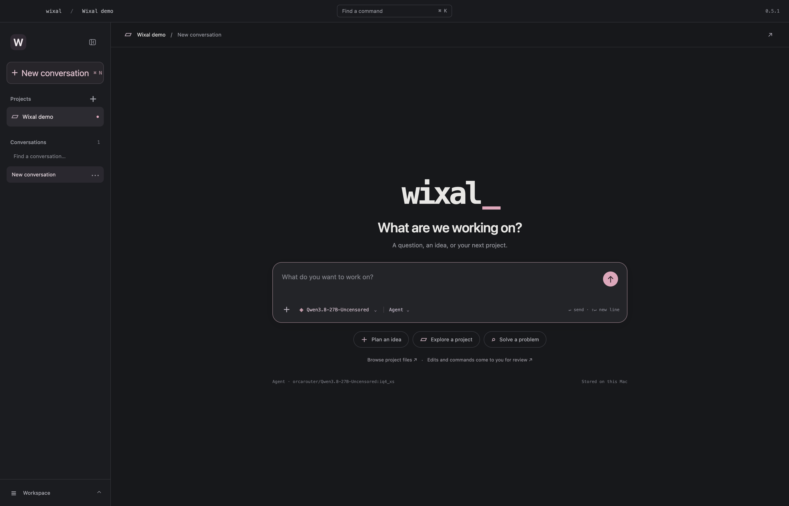
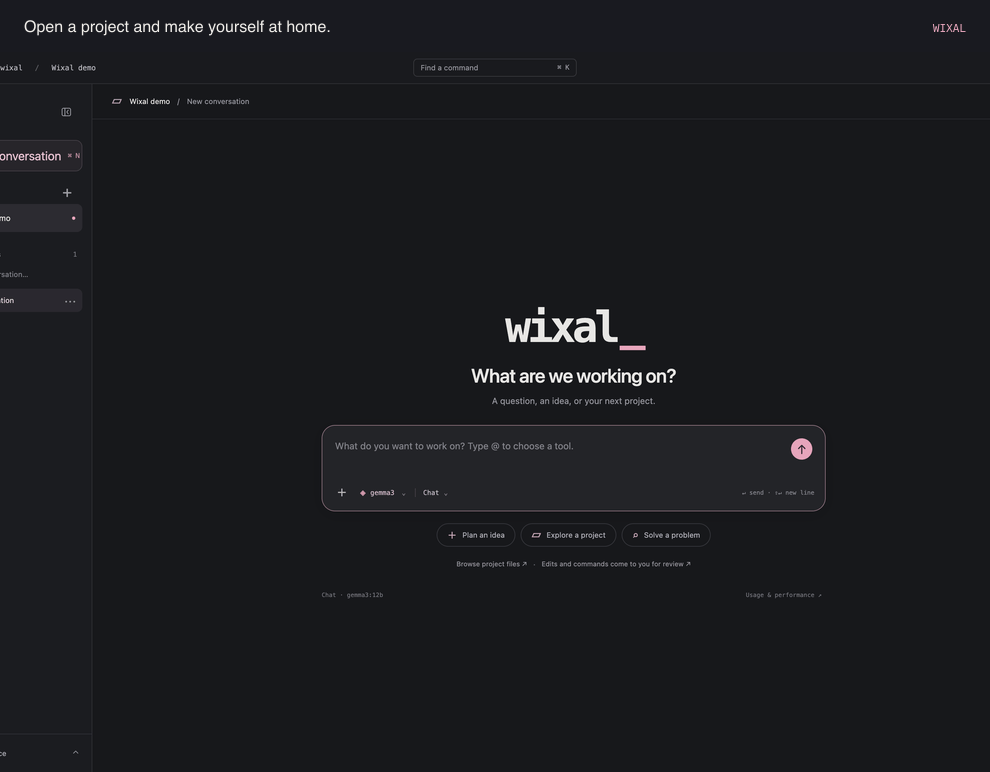

# Wixal

Local AI for your Mac. Chat with models, work with project files, and keep your notes and terminal in one place.

**[Download Wixal for Mac](https://github.com/TheJhyeFactor/Wixal/releases/latest)** · [What's new](CHANGELOG.md)

Version **0.5.1** · Apple Silicon · macOS 13 or newer

## Work your way

- **Choose a model.** Use Ollama on your Mac or connect OpenAI, ChatGPT, Claude, Gemini, Grok, DeepSeek, Groq, Mistral, OpenRouter, or a compatible endpoint.
- **Bring in your project.** Browse and search files, attach images, and save notes for later conversations.
- **Stay in control.** Choose the tools an agent can use. Review file changes and commands before they run.
- **Keep chats tidy.** Search conversations, archive and restore them, or delete them when you're done.
- **Pick up the terminal.** Work in an interactive zsh terminal beside your project.
- **Connect ChatGPT.** Share selected projects with the private Wixal companion, then review queued tasks in the app.

## Get started

1. Download the DMG and drag **Wixal.app** into **Applications**.
2. Start Ollama with a model installed, or connect an AI provider in **Connections**.
3. Open a project with **⌘O**, choose a model with **⌘L**, and start a conversation.

Cloud providers receive conversation content and any project context you allow for that workspace. Ollama runs locally. Conversations and project notes are saved on your Mac; provider keys are stored in macOS encrypted storage.

Wixal is an early preview and is not Developer ID signed or notarised. See the [release notes](https://github.com/TheJhyeFactor/Wixal/releases/latest) for installation details.

## Learn more

[User guide](docs/user-guide.md) · [Provider and ChatGPT setup](docs/connections.md) · [Development](docs/development.md) · [Contributing](CONTRIBUTING.md) · [Changelog](CHANGELOG.md)

Watch a quick tour

