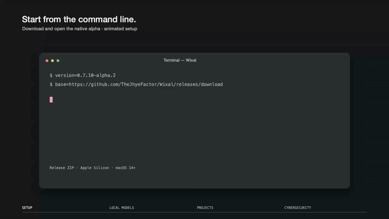

<p align="center">
  
</p>

<h3 align="center">Local AI for your projects.</h3>

<p align="center">A native Mac workspace for local models, agents, workflows and project tools.</p>

<p align="center">
  <a href="https://github.com/TheJhyeFactor/Wixal/releases/download/v0.7.10-alpha.2/Wixal-0.7.10-alpha.2-macOS-arm64.zip"><strong>Download native alpha ↓</strong></a> &nbsp;·&nbsp;
  <a href="https://thejhyefactor.github.io/Wixal/">Website</a> &nbsp;·&nbsp;
  <a href="docs/native-alpha.md">Alpha guide</a> &nbsp;·&nbsp;
  <a href="https://github.com/TheJhyeFactor/Wixal/releases/tag/v0.7.10-alpha.2">Release notes</a>
  <br><sub>0.7.10 Alpha 2 · Apple Silicon · macOS 14+ · Ad-hoc signed, not notarised</sub>
</p>

<p align="center">
  <a href="https://thejhyefactor.github.io/Wixal/" aria-label="Watch the full-quality Wixal demo">
    <picture>
      <source media="(prefers-reduced-motion: reduce)" srcset="assets/motion/wixal-demo-still.png">
      
    </picture>
  </a>
</p>

<p align="center"><a href="https://thejhyefactor.github.io/Wixal/">Watch the full-quality demo ↗</a></p>

From a typed download command to a local model working with project files, then an authorised cybersecurity investigation. The install sequence is animated; the app footage shows real local runs with elapsed time shortened.

## The current app

The current download is **Wixal.app**, built with SwiftUI, AppKit and a persistent Python engine. The app includes its Python runtime and local Ollama inference engine. No Node, Electron or separately installed Python is required to run it. Model weights are downloaded or imported separately.

| Workspace | What you can do |
| --- | --- |
| Chat and projects | Open a project, ask questions, work with files and inspect returned evidence. |
| Agents | Save reusable agents, describe tasks, set authority and success criteria, and review run history. The model selects eligible tools. |
| Workflows | Connect steps with dependencies, execute bounded parallel branches, verify artifacts and inspect failures. |
| Recurring tasks | Save calendar or interval routines. Optional macOS background execution runs while the Mac is awake; actions requiring review pause. |
| Skills | Load reusable procedures, save skills and compare candidate versions against explicit evaluation cases. |
| Tools | Project file operations, command sessions, web/API access, native WebKit browser actions and trusted MCP connections. |
| Memory | Editable notes, local recall, visible summaries, reviewed memory suggestions and optional encrypted folder sync. |
| Cybersecurity | Authorised scope, bounded investigations, evidence and findings records. Nmap needs a local installation. |
| Models and terminal | Local model downloads/imports, external Ollama, usage measurements and an interactive project terminal. |

## Install

1. [Download the alpha ZIP](https://github.com/TheJhyeFactor/Wixal/releases/download/v0.7.10-alpha.2/Wixal-0.7.10-alpha.2-macOS-arm64.zip), extract it and move **Wixal.app** to **Applications**.
2. This alpha is **not Developer ID signed or notarised**. If macOS blocks the first launch, review the source and release notes, then use **System Settings → Privacy & Security → Open Anyway**.
3. Open **Models** and download a tool-capable model, import compatible Ollama weights or configure an external Ollama server.
4. Open a project with **⌘O**. Start a conversation or open **Agents** to create an agent or workflow.

Prefer the command line? Download and extract the same release:

```sh
version=0.7.10-alpha.2
base=https://github.com/TheJhyeFactor/Wixal/releases/download
curl -fL -o Wixal.zip \
  "$base/v$version/Wixal-$version-macOS-arm64.zip"
ditto -x -k Wixal.zip .
open Wixal.app
```

The macOS first-launch review above still applies. Move the extracted app to **Applications** when you are ready to keep it.

Updates are manual downloads from GitHub. Existing native workspaces remain at `~/Library/Application Support/Wixal Native`. Earlier Electron data can be imported explicitly; original data is retained.

## Alpha status

Real local agent acceptance has passed with **gpt-oss:20b** for implemented workflows, including tools, artifact verification, schedules and reusable skills. This does not establish equal reliability across models or full Hermes parity. The alpha is intended for testing and feedback.

Remaining work includes remote/off-Mac execution, messaging and voice gateways, broader model/service acceptance, production security evaluation, actual sleep/wake/reboot acceptance, full accessibility coverage, Developer ID signing, notarisation and automatic updates. Encrypted sync still needs a real two-Mac acceptance run; service-specific OAuth and account lifecycle flows need broader live verification.

[Native alpha guide](docs/native-alpha.md) · [Engine and build guide](native/README.md) · [Agent acceptance and limitations](native/AGENTS_COMPLETION_ACCEPTANCE_2026-10-08.md)

## Build from source

The canonical development and release source is `native/` on `main`.

The source branch also includes a native tools library and managed RustScan development pilot. Controlled forks, exact source pins and unsigned build candidates live in [wixal-tools](https://github.com/TheJhyeFactor/wixal-tools). See the [implementation and measured acceptance status](native/MANAGED_TOOLS_IMPLEMENTATION_STATUS.md) for the current limits. This work is not yet included in the alpha download linked above, and a public managed installer catalogue has not been qualified.

```sh
python3 -m venv native/.venv
native/.venv/bin/python -m pip install -r native/requirements-build.txt
./script/build_and_run.sh --package-only
native/.venv/bin/python native/scripts/install.py --alpha
```

The build is `release/native/Wixal.app`. See the [native guide](native/README.md) for runtime staging, tests and signing options. Earlier Electron source and releases remain available for history and migration; they are not the current download.

[Report an issue](https://github.com/TheJhyeFactor/Wixal/issues) · [Contribute](CONTRIBUTING.md) · [Third-party notices](THIRD_PARTY_NOTICES.md)
