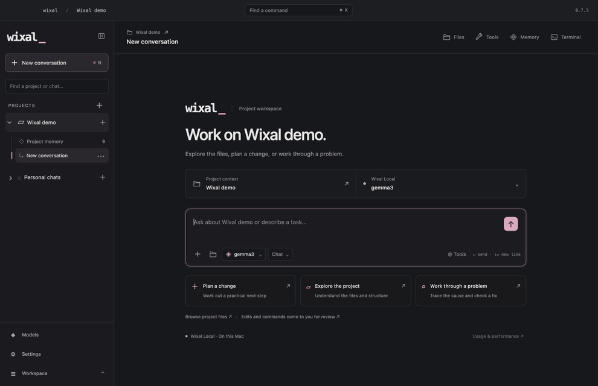
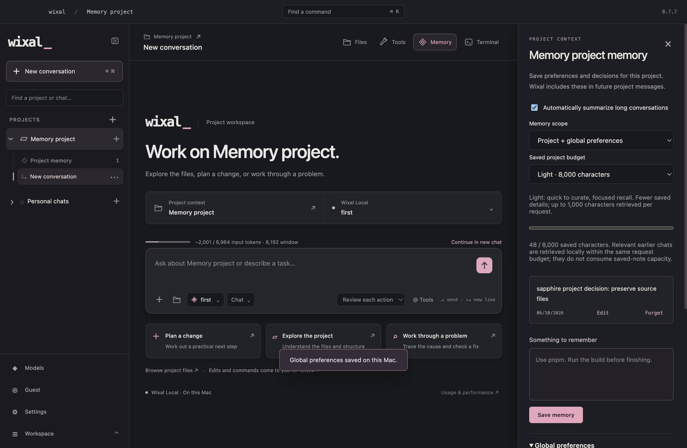
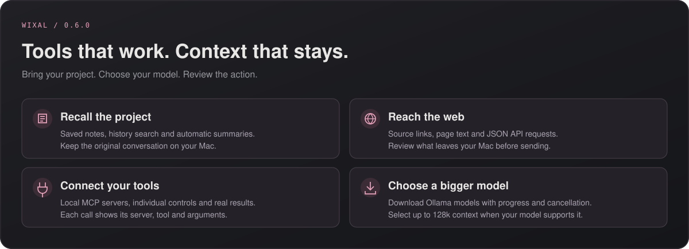
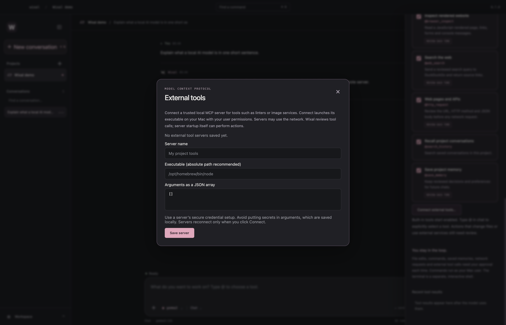

  <picture>
    <source media="(prefers-reduced-motion: reduce)" srcset="assets/motion/logo-reveal-still.png">
    
  </picture>

<h3 align="center">AI, project files, and a terminal for your Mac.</h3>

  Run local models with the engine included in Wixal. 
  Work on real files, recall your project, and connect tools you can review.

  <a href="https://github.com/TheJhyeFactor/Wixal/releases/download/v0.7.9/Wixal-0.7.9-macOS-arm64.dmg"><strong>Download for Mac</strong></a> &nbsp;·&nbsp;
  <a href="https://github.com/TheJhyeFactor/Wixal/releases/download/v0.7.9/Wixal-0.7.9-macOS-arm64.zip">ZIP</a> &nbsp;·&nbsp;
  <a href="https://github.com/TheJhyeFactor/Wixal/releases/tag/v0.7.9">Release notes</a>
   
  Version 0.7.9 &nbsp;·&nbsp; Apple Silicon &nbsp;·&nbsp; macOS 14 or newer

  <a href="#a-place-for-your-project">Overview</a> &nbsp;/&nbsp;
  <a href="#local-engine-and-assessments-in-075">What’s new</a> &nbsp;/&nbsp;
  <a href="#choose-your-model">Models</a> &nbsp;/&nbsp;
  <a href="#get-started">Get started</a> &nbsp;/&nbsp;
  <a href="#guides--development">Guides</a>

---

## A place for your project

Open a folder and start a conversation. Your files, saved notes, and terminal are there when you need them.

- **Bring the context.** Browse and search project files, attach images, and save notes for future conversations.
- **Review the work.** Choose which tools the model can use. Choose Review each action or Approved all for the workspace.
- **Pick up where you left off.** Search saved chats, archive and restore conversations, and open a zsh terminal beside your project.

<strong>See Wixal in action</strong> — a short tour of the app

[View the screenshots](docs/screenshots) for a still version of the tour.

## Current release: 0.7.9

The published 0.7.9 DMG and ZIP contain the Electron app, including launch and appearance refinements and clearer tool and memory workflows. The separate native SwiftUI/Python preview is available in this source tree and local development package, as documented in [`native/IMPLEMENTATION_STATUS_2026-10-07.md`](native/IMPLEMENTATION_STATUS_2026-10-07.md). Its semantic memory, reviewed local-model memory suggestions, consolidation, encrypted folder sync, remote HTTP MCP, awake closed-app schedules and interactive WebKit features are native preview capabilities; they are not included in the published Electron downloads. The native preview remains Apple Silicon macOS-only and development-signed.

Known limitations are documented in [the native completion status](native/IMPLEMENTATION_STATUS_2026-10-07.md) and [the remaining review](native/REMAINING_REVIEW.md). Fresh account creation/verification, exhaustive VoiceOver and minimum-size UI coverage, external OAuth providers, two-device cloud-folder delivery, sleeping-Mac wake, other platforms, comparative app performance, and Developer ID/notarised distribution remain follow-up work. Cloud inference and the external ChatGPT companion remain deferred.

The 0.7.8 release adds isolated browser sessions with reviewed navigation, clicks and ordinary form controls; delayed-content waits; readable search snippets; paginated HTTP and file-search results; exact file edits and directory creation. Tool schemas are loaded by task so enabled tools leave more room for the conversation. Declined actions and three identical tool failures end tool execution for that turn. [Tool workflows and limits](docs/tool-workflows.md).

The preceding 0.7.7 release added project memory scopes and budgets, a small optional account profile, context usage estimates, new-chat summary handoff and reliable local model switching. It includes workspace/tool context, workspace-scoped Approved all, website assessment fixtures and Nmap assessment profiles. [Memory and limits](docs/memory.md) · [Assessment profiles](docs/cyber-tools.md).

## Memory that stays under your control

- **Choose the scope.** Each project can use project-only memory, project + global preferences, global preferences only, or memory off. Relevant earlier active project chats can be recalled automatically.
- **Keep the global profile small.** Save up to 1,200 characters of personal preferences. Guest profiles stay on this Mac; verified account profiles sync explicitly through Firebase.
- **See the limits.** Saved project budgets are 8,000, 24,000 or 48,000 characters. Context defaults to 8k tokens, with a model/RAM-aware ceiling of 32k and room reserved for replies.
- **Continue cleanly.** A filling context meter recommends a fresh chat or a visible AI summary carried into another chat. The original conversation remains saved.
- **Change models in the same chat.** Older tool exchanges become readable evidence when needed, preserving the conversation across local model changes.

[How memory, context and model switching work](docs/memory.md) · [0.7.7 release notes](docs/release-0.7.7.md)

## Workspace refinements in 0.7.3

**A more useful main workspace, introduced in 0.7.2 and refined in 0.7.3.** Project and model readiness sit beside the composer, with Files, Tools, Memory and Terminal directly in the header. The local provider remains **Wixal Local**.

- **Move between layouts.** The sidebar fades and moves together, reverses smoothly, and respects reduced motion.
- **Keep your place.** Text drafts save on this Mac and return when you switch chats or reopen the app.
- **Work through long replies.** Copy individual code blocks, jump to the latest message and read earlier content while a reply streams.
- **Choose deliberately.** Chat and Agent have explicit choices with descriptions. The Models page still handles selection, in-app downloads and measured performance.

Streaming updates the pending reply without rebuilding saved messages on each frame. This reduces renderer work; model inference speed depends on the model and your Mac.

[0.7.7 release notes](docs/release-0.7.7.md) · [Models and performance guide](docs/performance.md) · [How Wixal Local works](docs/local-runtime.md)

Wixal Local is built on pinned open-source Ollama 0.35.1, with its original credits and notices preserved. Models already installed in Ollama can be imported; all inference runs through Wixal’s included engine. [Upstream credits](THIRD_PARTY_NOTICES.md)

## Project tools, memory and connections

| Feature | What you can do |
| :--- | :--- |
| **Memory that carries forward** | Keep project notes, search earlier chats, and continue long conversations with automatic saved summaries. |
| **Real project work** | Read files in chunks, review edits, and execute commands with output, exit status and cancellation. |
| **Web pages and APIs** | Enable web search or HTTP tools, review the request, and get real source links, page text or JSON. |
| **External MCP tools** | Connect trusted local servers for additional capabilities and choose which tools the model can call. |
| **Models on your Mac** | Download model tags or import installed Ollama weights, then run them through Wixal’s included engine. |
| **Network assessments** | Scan authorised networks, sites and IPs with eight Nmap profiles, read results, cancel jobs and save evidence. |

Built-in tools start enabled and are available to models marked **Tools** in both Chat and Agent. Search or filter them in **Tools in the workspace header**, or type **@tool_name** in chat to request a particular tool. Other enabled tools remain available for follow-up; a request missing a URL, path or target can be clarified in chat. Every request includes the current workspace, approval policy and enabled tools automatically. Review each action opens approval dialogs; Approved all lets enabled tools run without repeated prompts in that workspace. Local inference, chats and notes stay on your Mac. Web and MCP tools can contact their configured services.

  <a href="docs/features.md"><strong>Explore the new features →</strong></a> &nbsp;·&nbsp;
  <a href="docs/features.md">Current feature guide</a>

<strong>External tools, ready for your project</strong>

Save a server executable and arguments, then click Connect to start the server and enable its tools. Calls show the server, tool and arguments before you approve them. See [the MCP setup guide](docs/features.md#external-mcp-tools).

## Choose your model

The picker has one engine: **Wixal Local**. Models ready in Wixal and models installed in the default Ollama library appear together. Click **Import & use** to verify and copy existing weights into Wixal’s independent library. Model publisher names, licences and capability badges are retained. No separate Ollama server or cloud inference connection is required.

The default context is 8k. GPT-OSS uses a supported reasoning level rather than an unsupported `think:false` request, and tool continuations retain the reasoning needed by the engine. Models marked **Tools** receive enabled tools automatically in Chat and Agent. Built-in tools need no MCP setup. [Local engine and imports](docs/local-runtime.md)

Select **Approved all** beside the composer to run enabled tools without individual approval dialogs. This setting persists for the selected workspace and can be revoked during a run. Other workspaces default to Review each action. [Network assessment workflows](docs/cyber-tools.md)

The optional companion can still share selected projects and queue tasks for Wixal. Those tasks run on the local engine when started in Wixal. [Companion setup](docs/connections.md)

## Get started

1. **Install Wixal.** [Download the DMG](https://github.com/TheJhyeFactor/Wixal/releases/download/v0.7.9/Wixal-0.7.9-macOS-arm64.dmg) and drag **Wixal.app** into **Applications**.
2. **Connect a model.** Open **Models** in the sidebar and download a model tag or click **Import & use** on an installed Ollama model.
3. **Open your project.** Press **⌘O** to choose a folder and **⌘L** to choose a model. Then start a conversation.

This preview is not Developer ID signed or notarised. If macOS blocks the first launch, see the [installation notes](https://github.com/TheJhyeFactor/Wixal/releases/tag/v0.7.9#install).

## Guides & development

A separate **SwiftUI/AppKit desktop and Python agent port** is under development in [`native/`](native/README.md). It runs alongside the Electron app. The native notes include build instructions, verification and an explicit feature-parity checklist; the published download above remains the Electron release.

| Looking for… | Start here |
| :--- | :--- |
| Tools, project recall, summaries and model downloads | [Feature guide](docs/features.md) |
| Everyday use and shortcuts | [User guide](docs/user-guide.md) |
| Optional companion and project sharing | [Connections](docs/connections.md) |
| Running and building the app | [Development](docs/development.md) · [Architecture](docs/architecture.md) |
| Reporting a bug or making a change | [Issues](https://github.com/TheJhyeFactor/Wixal/issues) · [Contributing](CONTRIBUTING.md) |
| Release history and design assets | [Changelog](CHANGELOG.md) · [Logo & motion](docs/visuals.md) |

Wixal Local is built on Ollama. Upstream engine licenses and model publisher licenses are retained. See [third-party notices](THIRD_PARTY_NOTICES.md) and [local runtime development](docs/local-runtime.md).

### Setup and Wixal accounts

Start with a guest workspace, or sign in with an email/password Wixal account backed by Firebase. Verified accounts can save and sync named workspace presets across Macs. Local chat, projects, models, memory and tools remain available to guests. Only explicitly saved presets are uploaded. Open **Account** in the sidebar, or run setup again from **Settings**. See [account setup and privacy boundaries](docs/accounts.md).
