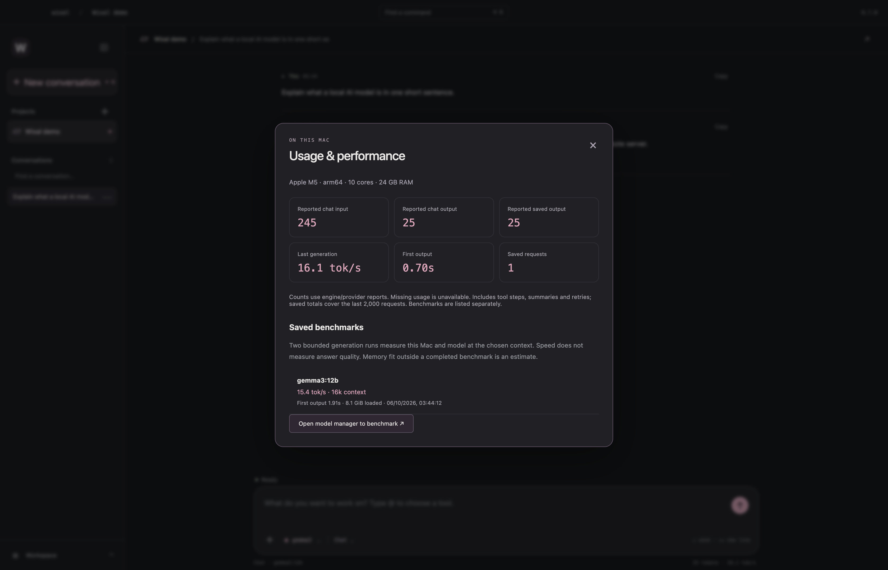

  <picture>
    <source media="(prefers-reduced-motion: reduce)" srcset="assets/motion/logo-reveal-still.png">
    
  </picture>

<h3 align="center">AI, project files, and a terminal for your Mac.</h3>

  Run local models with the engine included in Wixal, or connect your preferred provider. 
  Work on real files, recall your project, and connect tools you can review.

  <a href="https://github.com/TheJhyeFactor/Wixal/releases/download/v0.7.0/Wixal-0.7.0-macOS-arm64.dmg"><strong>Download for Mac</strong></a> &nbsp;·&nbsp;
  <a href="https://github.com/TheJhyeFactor/Wixal/releases/download/v0.7.0/Wixal-0.7.0-macOS-arm64.zip">ZIP</a> &nbsp;·&nbsp;
  <a href="https://github.com/TheJhyeFactor/Wixal/releases/tag/v0.7.0">Release notes</a>
   
  Version 0.7.0 &nbsp;·&nbsp; Apple Silicon &nbsp;·&nbsp; macOS 14 or newer

  <a href="#a-place-for-your-project">Overview</a> &nbsp;/&nbsp;
  <a href="#new-in-070">What’s new</a> &nbsp;/&nbsp;
  <a href="#choose-your-model">Models</a> &nbsp;/&nbsp;
  <a href="#get-started">Get started</a> &nbsp;/&nbsp;
  <a href="#guides--development">Guides</a>

---

## A place for your project

Open a folder and start a conversation. Your files, saved notes, and terminal are there when you need them.

- **Bring the context.** Browse and search project files, attach images, and save notes for future conversations.
- **Review the work.** Choose which tools the model can use. Approve file edits and commands before they run.
- **Pick up where you left off.** Search saved chats, archive and restore conversations, and open a zsh terminal beside your project.

<strong>See Wixal in action</strong> — a short tour of the app

[View the screenshots](docs/screenshots) for a still version of the tour.

## New in 0.7.0

**Wixal Local is included.** No separate Ollama app is required. The app manages its engine, keeps a model library of its own, and can import models already on your Mac.

| You control | How it works |
| :--- | :--- |
| **The local engine** | Starts with local model requests, runs on loopback, and shuts down with Wixal. Start or stop it from the picker. |
| **Your model library** | Download by registry tag or import an existing Ollama model. Imports make independent copies and verify the model files. |
| **Your performance** | View reported tokens and speed, run real benchmarks, filter by type/size/hardware fit, and delete models from the active library. |
| **Your tools** | Search a redesigned tool kit, enable all tools, and explicitly request a tool with @ in chat. |
| **Your setup** | Use the included engine or switch to a separate Ollama server. Cloud providers remain optional. |
| **Our foundation** | Built on pinned open-source Ollama 0.35.1, with its name, copyrights and dependency notices preserved. Staging and source-build workflows are included. |

[How Wixal Local works and how to build on it →](docs/local-runtime.md) · [0.7.0 release notes](https://github.com/TheJhyeFactor/Wixal/releases/tag/v0.7.0) · [Upstream credits](THIRD_PARTY_NOTICES.md)

[Model management, benchmarks and @tools →](docs/performance.md)

## Project tools, memory and connections

| Feature | What you can do |
| :--- | :--- |
| **Memory that carries forward** | Keep project notes, search earlier chats, and continue long conversations with automatic saved summaries. |
| **Real project work** | Read files in chunks, review edits, and execute commands with output, exit status and cancellation. |
| **Web pages and APIs** | Enable web search or HTTP tools, review the request, and get real source links, page text or JSON. |
| **External MCP tools** | Connect trusted local servers for additional capabilities and choose which tools the model can call. |
| **Models on your terms** | Download local Ollama models from the picker, cancel downloads, and choose context windows up to 128k when supported. |

Built-in tools start enabled. Search or filter them in **Workspace → Tool kit**, or type **@tool_name** in chat to explicitly select a tool. Actions that edit files, run commands, save memories or use external services still come to you for review. Local inference, chats and notes stay on your Mac unless you enable a cloud provider or approve an external action.

  <a href="docs/features.md"><strong>Explore the new features →</strong></a> &nbsp;·&nbsp;
  <a href="docs/features.md">0.6.0 feature guide</a>

<strong>External tools, ready for your project</strong>

Save a server executable and arguments, then click Connect to start the server and enable its tools. Calls show the server, tool and arguments before you approve them. See [the MCP setup guide](docs/features.md#external-mcp-tools).

## Choose your model

| Where you work | Connections |
| :--- | :--- |
| **On your Mac** | Wixal Local, included in the app; external Ollama is also supported |
| **With a cloud provider** | OpenAI, ChatGPT, Claude, Gemini, Grok, DeepSeek, Groq, Mistral, and OpenRouter |
| **With your own endpoint** | A compatible Chat Completions endpoint |

The optional Wixal companion also lets ChatGPT read selected projects and send tasks to your inbox. You choose what to share and start the tasks in Wixal. [Set up providers and ChatGPT →](docs/connections.md)

Conversations and project notes are saved on your Mac. When you use a cloud model, that provider receives the conversation and the project context you allow. Provider keys use macOS encrypted storage.

## Get started

1. **Install Wixal.** [Download the DMG](https://github.com/TheJhyeFactor/Wixal/releases/download/v0.7.0/Wixal-0.7.0-macOS-arm64.dmg) and drag **Wixal.app** into **Applications**.
2. **Connect a model.** Choose Wixal Local in **⌘L** and download or import a model, or open **Workspace → Connections** to add a provider.
3. **Open your project.** Press **⌘O** to choose a folder and **⌘L** to choose a model. Then start a conversation.

This preview is not Developer ID signed or notarised. If macOS blocks the first launch, see the [installation notes](https://github.com/TheJhyeFactor/Wixal/releases/tag/v0.7.0#install).

## Guides & development

| Looking for… | Start here |
| :--- | :--- |
| Tools, project recall, summaries and model downloads | [Feature guide](docs/features.md) |
| Everyday use and shortcuts | [User guide](docs/user-guide.md) |
| Providers, sign-in, and project sharing | [Connections](docs/connections.md) |
| Running and building the app | [Development](docs/development.md) · [Architecture](docs/architecture.md) |
| Reporting a bug or making a change | [Issues](https://github.com/TheJhyeFactor/Wixal/issues) · [Contributing](CONTRIBUTING.md) |
| Release history and design assets | [Changelog](CHANGELOG.md) · [Logo & motion](docs/visuals.md) |

Wixal Local is built on Ollama. Upstream engine licenses and model publisher licenses are retained. See [third-party notices](THIRD_PARTY_NOTICES.md) and [local runtime development](docs/local-runtime.md).
