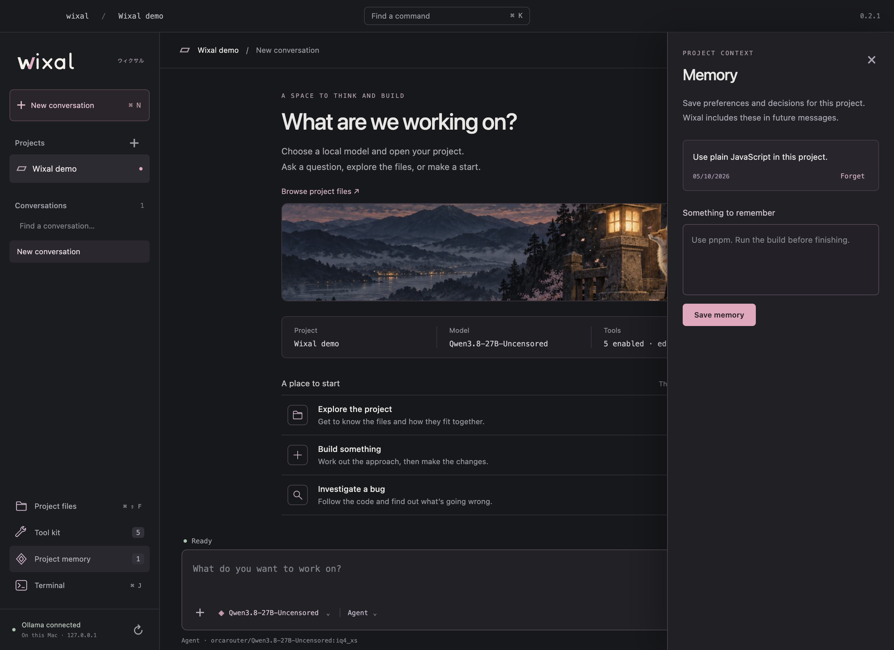

# Wixal

A Mac app for working on projects with local AI. Chat with an Ollama model, browse your files, and use the terminal in one place.

**[Download for Mac](https://github.com/TheJhyeFactor/Wixal/releases/download/v0.2.1/Wixal-0.2.1-macOS-arm64.dmg)** · [ZIP](https://github.com/TheJhyeFactor/Wixal/releases/download/v0.2.1/Wixal-0.2.1-macOS-arm64.zip) · [Release notes](https://github.com/TheJhyeFactor/Wixal/releases/latest)

Version 0.2.1 · Apple Silicon · macOS 13+ · Preview

## Features

<table>
<tr>
<td width="50%"><strong>Local models</strong> Choose from your installed Ollama models.   <a href="docs/screenshots/models.png">Still image</a></td>
<td width="50%"><strong>Project files</strong> Browse files and add them to a chat.   <a href="docs/screenshots/files.png">Still image</a></td>
</tr>
<tr>
<td><strong>Terminal</strong> Run commands without leaving Wixal.   <a href="docs/screenshots/terminal.png">Still image</a></td>
<td><strong>Project notes</strong> Save notes to use in later conversations.  </td>
</tr>
</table>

Choose which tools the model can use. Wixal asks for approval before it edits a file or runs a command. The terminal runs commands directly on your Mac.

## Install

1. Download the DMG and drag **Wixal.app** into **Applications**.
2. Start [Ollama](https://ollama.com) with at least one model installed.
3. Open Wixal, choose a project with **⌘O**, and select a model with **⌘L**.

Requires an Apple Silicon Mac running macOS 13 or newer. This preview is not Developer ID signed or notarised, so macOS may block the first launch. See the [release notes](https://github.com/TheJhyeFactor/Wixal/releases/latest) for help.

## More

[User guide](docs/user-guide.md) · [Development](docs/development.md) · [Contributing](CONTRIBUTING.md) · [Changelog](CHANGELOG.md) · [Logos](docs/visuals.md)

App tour and still images

[Watch the app tour](docs/media/workspace-tour.gif) · [Workspace screenshot](docs/screenshots/workspace.png) · [Static header](assets/repo-banner.png)

