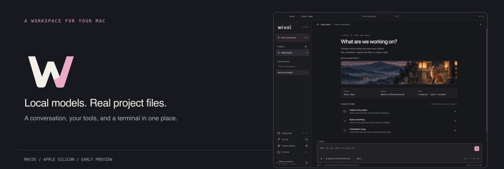
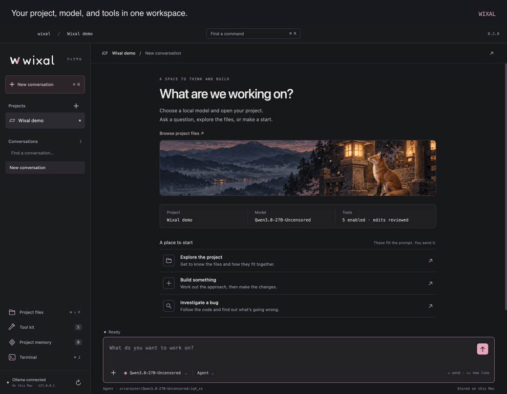
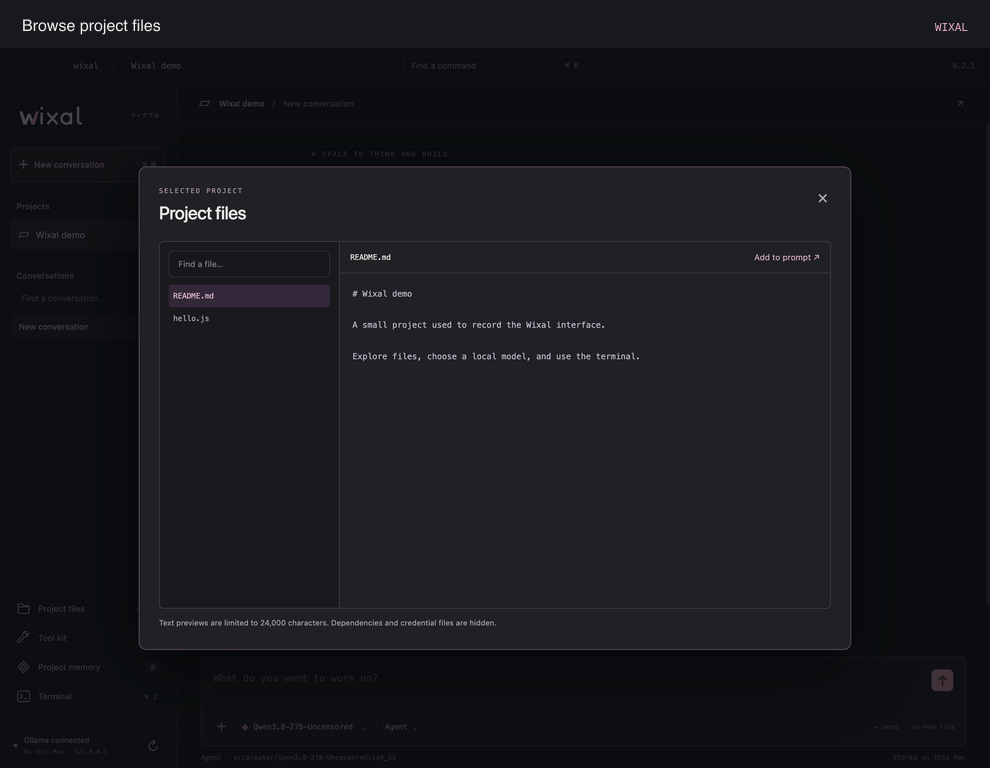

[View the still header](assets/repo-banner.png) · [Logo and motion files](docs/visuals.md)

# Wixal

Wixal brings Ollama, your project files, and a terminal together in a Mac app. Use it to talk through an idea, find your way around a codebase, or work on a change with a local model. When the model wants to edit a file or run a command, you get to review it first.

**0.2.0 · macOS Apple Silicon · Early preview**

[Get started](#get-started) · [See it in action](#see-how-it-feels) · [How it works](docs/architecture.md) · [Contribute](CONTRIBUTING.md) · [What's changed](CHANGELOG.md)

## See how it feels

Choose a model, open a project, and get to work. Your conversation, files, project notes, and terminal stay together.


[View a still of the workspace](docs/screenshots/workspace.png)

The recordings use the running app and a small demo project. They show real interface interactions, not simulated model replies. The models shown are installed on the test Mac; you'll see your own Ollama library.

## Start with the model. Then get into the files.

<table>
<tr>
<td width="50%"><strong>Choose a local model</strong><br>Search your Ollama library and see which models support tools and images.</td>
<td width="50%"><strong>Bring a file into the conversation</strong><br>Read the project, preview the code, and add what matters to your next message.</td>
</tr>
<tr>
<td></td>
<td></td>
</tr>
<tr>
<td><a href="docs/screenshots/models.png">View still image</a></td>
<td><a href="docs/screenshots/files.png">View still image</a></td>
</tr>
</table>

## Keep your terminal close

When you want to run the project yourself, open the built-in zsh terminal. The recording below runs a real JavaScript file and shows its output.


[View a still of the terminal](docs/screenshots/terminal.png)

You can also save project preferences, pick up earlier conversations, and attach images to models that support them. In Agent mode, choose which tools are available and review file edits and commands before they run.

## Get started

You'll need an **Apple Silicon Mac**, [Ollama](https://ollama.com) running locally, and at least one installed model. To run Wixal from source, you'll also need **Node.js 22 or newer** and the Xcode command line tools.

```sh
git clone https://github.com/TheJhyeFactor/Wixal.git
cd Wixal
npm ci
npm run rebuild
npm start
```

Open a project with **⌘O** and choose a model with **⌘L**. Then ask a question or describe what you'd like to work on.

Models labelled **Tools** can use the project tools in Agent mode. Models labelled **Images** can receive image attachments. For a conversation without tools, switch to Chat mode. Wixal also switches to Chat when a model doesn't have confirmed tool support.

Wixal connects to Ollama at `http://127.0.0.1:11434`. It doesn't download models, send prompts to a cloud provider, or collect analytics. If Ollama isn't running, the app shows you how to connect.

This is an early preview. The app is **not Developer ID signed or notarised**; the instructions above are for running it from source.

## What the model can do

| Tool | What happens | Your involvement |
| --- | --- | --- |
| List files | Lists files in the selected project | Read only |
| Read files | Reads project text files | Read only |
| Search files | Finds literal text in the project | Read only |
| Edit or create a file | Creates or replaces a text file | Review the before and after, then approve |
| Run a command | Runs a non-interactive zsh command from the project | Review the command, then approve |

File tools check the project boundary, resolve symlinks, and block common credential paths. **Approved shell commands and the interactive terminal run with your Mac user's access. They are not a filesystem sandbox.**

You can stop a response. Agent commands have a 60 second timeout, and the agent loop is limited to 12 steps. Use the terminal for interactive programs.

Conversations, image attachments, project memories, and preferences are saved locally in `~/Library/Application Support/Wixal/workspace.json`. Project memory is added only when you save it. The file uses private permissions and atomic writes, but the contents are not encrypted.

Image messages accept up to three PNG, JPEG, or WebP files, each under 12 MB. Wixal applies photo orientation and resizes images to a maximum of 1,600 pixels on the longest edge before sending them to the local model. Capability labels describe model metadata; they don't guarantee the quality of a model's answer.

<details>
<summary>Keyboard shortcuts</summary>

| Shortcut | Action |
| --- | --- |
| ⌘O | Open a project |
| ⌘N | Start a conversation |
| ⌘K | Find a command |
| ⌘L | Choose a model |
| ⌘J | Show or hide the terminal |
| ⌘⇧F | Browse project files |
| ⌘⇧T | Open the tool kit |
| ⌘⇧M | Open project memory |
| Enter / Shift+Enter | Send / add a new line |


</details>

## Working on Wixal

```sh
npm test
npm run check
npm run test:app
npm run package
```

The app test exercises the real Electron interface and terminal. Its full run also uses an installed local model to request a file edit, checks the approval flow, and verifies image input and memory recall. See the [development guide](docs/development.md) for test prerequisites and packaged app checks.

Browser automation, macOS screen control, MCP connectors, cloud providers, model downloads, and automatic context summarisation aren't implemented yet. Recent complete turns are included within an estimated context budget; older conversations remain saved.

If you'd like to help, start with [CONTRIBUTING](CONTRIBUTING.md) and the [architecture notes](docs/architecture.md). The [artwork and motion guide](docs/visuals.md) includes the editable SVGs, image sources, and instructions for recording a fresh app tour.

## The Wixal logo

One folded W starts the name, with “ixal” flowing from it. The same W is used in the Mac app icon.


[Download the SVG logo](assets/logo/wixal.svg) · [Transparent PNG](assets/logo/wixal.png) · [Logo for light backgrounds](assets/logo/wixal-dark.svg) · [Full asset guide](docs/visuals.md)
