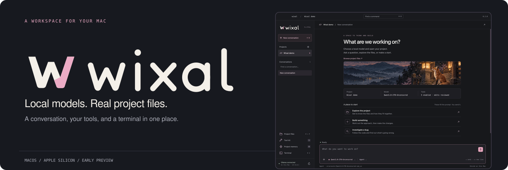
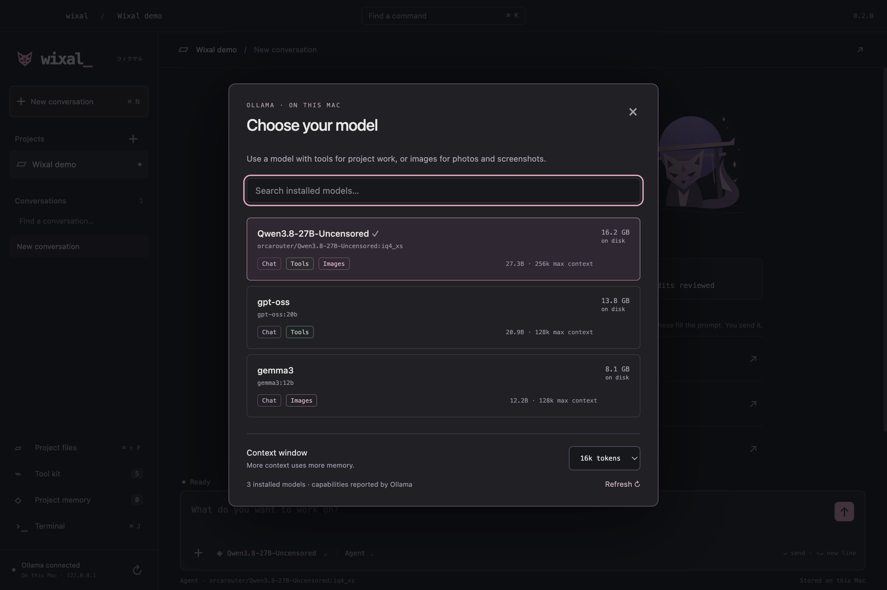
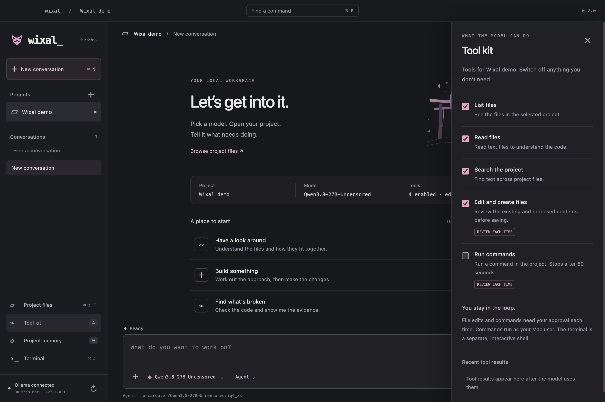
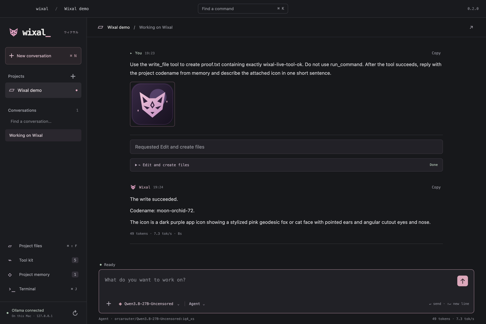
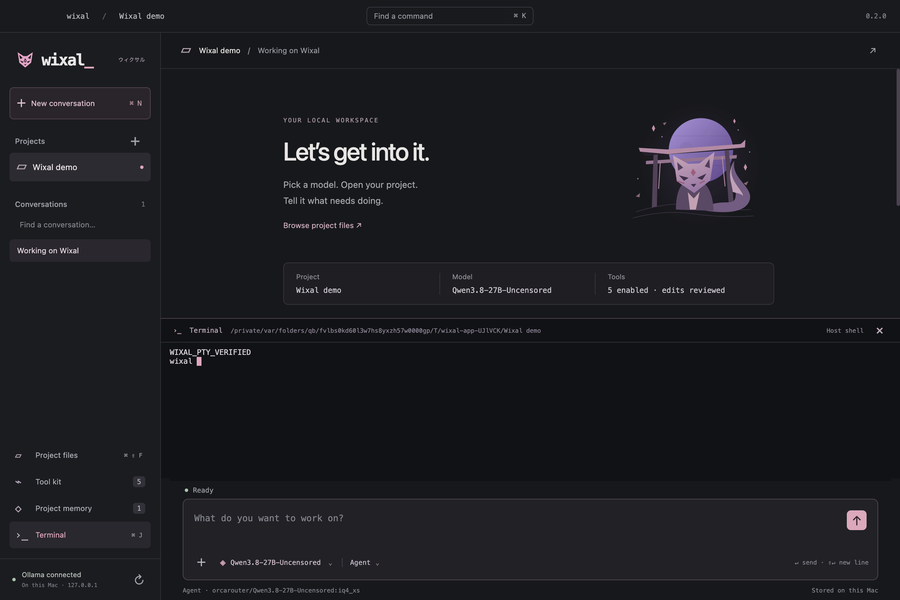

# Wixal

I’m building Wixal as a local AI workspace for my Mac. Open a project, pick an Ollama model and get into the files. Chat, project tools and a real terminal in one window.

The interface keeps things simple. Dark colours, a bit of pink, and an original fox identity. The model does the work locally, and file edits and commands come to you for review.

**Current build: 0.2.0 · macOS Apple Silicon · early preview**


## What works

- Streaming local chat through Ollama, with saved projects and conversations.
- A searchable model picker showing tools, image support, parameter count, disk size and reported maximum context.
- Agent mode for project work, Chat mode for conversation. Choosing a model without confirmed tool support switches to Chat.
- A tool kit where you can switch file listing, reading, search, editing and commands on or off. Disabled tools are also blocked by the controller.
- Project file browsing, text previews and an “Add to prompt” action.
- Photo and screenshot attachments for models with image support. Review thumbnails before sending and reopen images from the conversation.
- A proper interactive zsh terminal using node-pty and xterm.js.
- Explicit project memory. Save what matters, forget it when you’re done.
- Conversation search and renaming, response copying, token and speed stats, and an 8k / 16k / 32k context setting.
- Keyboard shortcuts, a command palette, cancellation and a review dialog for file changes and commands.

<table>
<tr><td></td><td></td></tr>
<tr><td>Choose a model that suits the job.</td><td>Choose what the model can do.</td></tr>
</table>

These are screenshots of the real app using a small test project. The model list reflects the models installed on the test Mac. Yours will show your own library.

## Get it running

You need an Apple Silicon Mac, [Ollama](https://ollama.com) running locally, and at least one installed model. For development, use Node.js 22 or newer and the Xcode command line tools.

```sh
git clone https://github.com/TheJhyeFactor/Wixal.git
cd Wixal
npm ci
npm run rebuild
npm start
```

Open a project with **⌘O**, choose a model using **⌘L**, then send a task. Models with **Tools** can work on project files. Models with **Images** can look at attachments. Capabilities come from Ollama’s model metadata; a capability label is not a guarantee of a model’s output quality.

Wixal connects to `http://127.0.0.1:11434`. It doesn’t download models, call a cloud provider or collect analytics. If Ollama is offline, the model picker explains how to get connected.

## The tool kit

| Tool | What it does | Review |
| --- | --- | --- |
| List files | Lists project files, skipping dependencies and protected paths | Read only |
| Read files | Reads text inside the selected project | Read only |
| Search files | Finds literal text across the project | Read only |
| Edit and create files | Creates or replaces a text file | Before and after, approve once |
| Run commands | Runs a non-interactive zsh command from the project | Command, approve once |

File tools check project boundaries, resolve symlinks and reject common credential paths. The shell is different: **approved commands and the interactive terminal run with your Mac user’s access. They are not a filesystem sandbox.**

Agent commands have a 60 second timeout. Responses can be stopped, and the agent loop has a 12 step limit. Interactive programs belong in the terminal.


## Images and memory

Attach up to three PNG, JPEG or WebP images per message. Input files must be under 12 MB. Images are converted to PNG and resized to a maximum of 1,600 pixels on the longest edge before being sent to the local model. The resized copies are saved with the conversation. Image messages follow Ollama’s [vision API](https://docs.ollama.com/capabilities/vision).

Project memories are saved only when you explicitly add them. There are no hidden automatic memory writes. Full conversations, resized images and preferences live in:

```text
~/Library/Application Support/Wixal/workspace.json
```

That file has private permissions and is written atomically. It is local JSON storage, not encrypted storage. Don’t put secrets in messages or project memories.

## Shortcuts

| Shortcut | Action |
| --- | --- |
| ⌘O | Open a project |
| ⌘N | New conversation |
| ⌘K | Command palette |
| ⌘L | Choose a model |
| ⌘J | Show or hide the terminal |
| ⌘⇧F | Project files |
| ⌘⇧T | Tool kit |
| ⌘⇧M | Project memory |
| Enter / Shift+Enter | Send / new line |

## Build and check

```sh
npm test
npm run check
npm run test:app
npm run package
```

`test:app` launches the actual Electron app with temporary state and a test project. It exercises models, files, tool settings, images, memory, the PTY, offline recovery and compact window layout. The full run also asks a real local tool-capable vision model to create a fixture file, reviews that edit, checks memory recall and confirms an image response. The current integration fixture expects installed Qwen and Gemma models.

Use `WIXAL_SKIP_MODEL_TEST=1 npm run test:app` to check the interface and terminal without inference. It still needs Ollama and the model metadata used by the fixture. Test screenshots are saved in `artifacts/`.

Packaging produces `release/Wixal-darwin-arm64/Wixal.app`. The native node-pty module is unpacked from asar so its spawn helper can run. To test that bundle:

```sh
WIXAL_APP_PATH="$PWD/release/Wixal-darwin-arm64/Wixal.app/Contents/MacOS/Wixal" npm run test:app
```

The current app is **not Developer ID signed or notarised**. Packaging a local app does not make it a signed public Mac distribution.

<details>
<summary>See the agent and terminal in the running app</summary>

The live model test wrote a fixture file after approval, recalled saved project memory and described the attached icon.





</details>

## Where it’s at

This is an early desktop app. Browser automation, macOS screen control, MCP connectors, cloud providers, model downloads and automatic context summarisation aren’t implemented. Context uses recent complete turns within an estimated character budget; older history stays saved. Switching to a text-only model keeps image attachments in history but leaves their image bytes out of that model’s request.

The renderer uses context isolation, sandboxing, a restricted preload bridge and sanitised Markdown. See [the architecture notes](docs/architecture.md) for the actual boundaries and [CONTRIBUTING](CONTRIBUTING.md) if you want to work on it.
