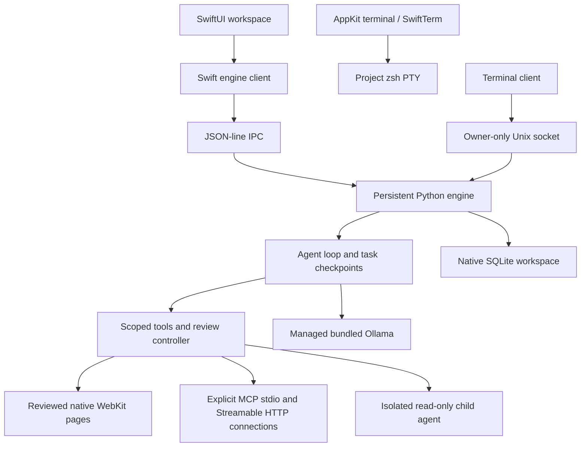

# Wixal Native

Working native macOS port alongside the Electron application. This is a **native preview** with the UI/UX audit corrections implemented. Feature and workflow acceptance is the current priority. Store distribution, public signing and update delivery are deferred by the user.

See the [UI and UX comparison](UI_UX_AUDIT.md) for the original findings, implementation update and validation limits.

The application uses SwiftUI for workspace screens, AppKit for file dialogs and the terminal, SwiftTerm for terminal emulation, WebKit for rendered web pages, and a separate Python agent engine. The bundled Ollama executable remains responsible for inference. The desktop UI and Python agent do not require Node or Electron. Rust is not part of this implementation.

## Run

The packaged app is `../release/native/Wixal Native.app`. The installed preview is `~/Applications/Wixal Native.app` once installation completes. The original `Wixal.app` is independent.

Terminal client, with the packaged Python runtime:

```sh
./native/scripts/wixal-packaged
```

From the repository root, the source client is `./native/scripts/wixal`. If the desktop is open, the terminal connects to its engine over an owner-only Unix socket. Otherwise, the terminal owns the workspace and engine until it exits. A workspace lock prevents two independent engines from overwriting each other's state. Use `--data /another/directory` for an independent workspace.

Useful terminal commands: `/project PATH`, `/models`, `/model NAME`, `/new`, `/tasks`, `/stop` when connected, `/quit`. Tool actions prompt for review. Rendered browser tools require the desktop.

## Build and check

The production Markdown parser has a standalone acceptance executable: `swift run --package-path native --build-system native MarkdownAcceptance`. It checks nested/multiline lists, task items, setext headings, resolved reference links, quoted fences, table escaping/alignment, inert HTML and permitted link schemes. It needs no mocked integration or XCTest installation.

```sh
python3 -m venv native/.venv
native/.venv/bin/python -m pip install -r native/requirements-build.txt
native/.venv/bin/python native/scripts/package.py --development
PYTHONPATH=native/engine:native/tests python3 -m unittest discover -s native/tests -v
native/.venv/bin/python native/scripts/acceptance.py
```

Requires macOS and Swift command-line tools. The build currently selects SwiftPM's native build system because the SwiftTerm Metal resource step in Swift Build requires a Metal compiler absent from this machine's Command Line Tools installation. SwiftTerm's AppKit terminal builds and runs with this configuration. The `ViewState` type alias explicitly selects SwiftUI's property wrapper on SDKs that also export a `State` macro.

`--development` explicitly produces a local preview with development signing. It does not establish Developer ID signing or notarisation. Distribution packaging requires `--identity 'Developer ID Application: …' --notary-profile PROFILE`, verifies the vendor runtime before signing, signs nested binaries, submits to notarytool, staples the ticket and checks Gatekeeper before replacing the previous bundle. The current Mac has no valid Developer ID identity, so distribution remains blocked. Both modes stage the bundle before replacing an existing build.

`acceptance.py --source` exercises current Python source; the default exercises the packaged helper. Both use the real bundled Ollama runner, real imported local models, a real image, measured benchmarks, localhost Nmap, conversation summaries, cancellation and model-selected tool execution. Reports are written after each stage in `artifacts/native/acceptance-current.json`. These checks do not prove account authentication, external sharing or every desktop interaction. Existing unit/fixture tests exercise edge cases and are separate evidence.

The package contains the Python interpreter and standard library, built with PyInstaller, plus Wixal's existing pinned Ollama payload. No user Python installation is required to run the app or packaged terminal client. Dependencies are pinned in `Package.resolved` and `requirements-build.txt`.

## Architecture



The AppKit terminal is an interactive host shell. Agent command sessions use independent Python-managed subprocesses, with bounded output, ownership checks, timeouts and process-group cancellation. Neither shell is an OS sandbox.

Python owns workspace state. Swift batches streamed text updates at approximately 40 ms intervals. Model inference remains in Ollama. The rewrite is not evidence of faster model generation. No controlled Electron-versus-native performance benchmark has been completed.

## Data and review boundaries

Native state: `~/Library/Application Support/Wixal Native/workspace.sqlite3`. Native model library: `~/Library/Application Support/Wixal Native/local-runtime/models`. Imported projects continue to point to their actual project directories: an approved file or command action can change those project files.

Import copies projects, conversations with saved images, notes, tasks, skills, paused schedules and local MCP command configurations by identifier. Appearance, auto-summary, enabled tools and supported local model/context preferences are imported. Invalid records produce visible warnings. Credential-bearing MCP invocations are excluded rather than rewritten into a different command. Repeated imports do not duplicate records. Original Electron storage is not written. Encrypted credentials, account tokens and companion pairing are excluded.

Models import from a displayed inventory. Blob hashes are checked; APFS clones are independent files, with a copy fallback. The original model library is not modified. The managed engine verifies the bundled file manifest, uses a fresh loopback port and disables Ollama cloud integration.

Review is the default. File writes recheck paths and existing contents after approval. Credential paths and files outside the selected project are rejected by file tools. Command output is bounded and belongs to its originating conversation/project. A declined action stops further tool execution for that agent turn. Bypass is an explicit workspace preference.

MCP servers start only on Connect and receive a small environment without inherited API-token variables. Connected tools must also be enabled. Child agents inherit only the parent's enabled read-only project tools, use separate conversations and storage, cannot recursively delegate, and have an eight-turn budget. Their output is returned as evidence to the parent.

With background scheduling disabled, schedules run only while the desktop engine is open. Enable closed-app scheduling in Task inbox to install a per-workspace macOS LaunchAgent. It runs while the Mac is awake, coalesces missed intervals into one latest run or skips them according to the schedule policy, and persists its claim before launch. Background actions requiring review pause for the desktop. Opening Wixal interrupts its own background owner safely and preserves interrupted tasks. The service runs after wake; it does not wake a sleeping Mac. Task completion means the agent finished its response; it does not certify success of the user's requested work.

WebKit pages use ephemeral storage and expose reviewed GET navigation, same-origin links, text fill, option selection and permitted control clicks with fresh references. Snapshots include headings, controls, form metadata, script URLs and console output; `wait_for` is bounded. Sensitive inputs and form submissions are blocked. Public same-origin GET/HEAD fetch and XHR reads use a bounded transport without cookies or credentials; writes, authenticated requests and redirects in this transport are rejected. Compatibility with streaming APIs, workers and complex third-party widgets is limited. Browser tools require the desktop.

Guest instructions and signed-in account instructions occupy separate slots. Agent context follows the active identity, and signing out restores guest instructions. Conversation-only models receive plain chat requests without tool definitions or tool-role history. The context meter is derived from the prepared request, including instructions, skills, summaries, tools and an explicit image allowance; it remains an estimate of the model tokenizer.

Helper requests have deadlines and connection-owned cancellation. Restart engine fails pending calls, closes browser work and starts a new helper generation without replaying uncertain actions. Summaries have a 90-second deadline and visible progress; when a model summary is unavailable, saved excerpts are explicitly labelled. Terminal sessions remain associated with their project folders while the app is open.

## Port status

| Track | State | Evidence / remaining work |
| --- | --- | --- |
| SwiftUI desktop and AppKit terminal | Implemented and packaged | Actual window inspected; terminal displayed real shell output |
| Separate persistent Python agent | Implemented | Packaged helper streams a real local model response |
| Desktop and terminal shared engine | Implemented | Owner-only Unix socket; standalone fallback and workspace lock |
| Projects, conversations and persistence | Implemented | Separate SQLite state; idempotent legacy import |
| Streaming chat, file tools and reviews | Implemented | Integration checks cover approval, decline and stale writes |
| Tool selection and project memory | Implemented | Eligible progressive schemas; bounded notes, FTS5 and optional local semantic recall; reviewed consolidation, source roles, correction and forgetting |
| Command sessions | Implemented | Real output/exit status, input, cancellation, pagination and saved output |
| Managed local models | Implemented | Verified bundled runner, model inventory/import/download; real GPT-OSS inference |
| Durable tasks and resume | Implemented | Checkpoint before execution; pause/cancel; uncertain actions are not replayed automatically |
| Skills | Implemented | Imported Markdown summaries, explicit selection and progressive `load_skill` tool |
| Delegation | Implemented, bounded | Separate read-only child agent; permission isolation checked |
| Recurring tasks | Implemented, real closed-app run passed | Opt-in macOS LaunchAgent; latest/skip missed-run policy, review pauses and interrupted-owner recovery; no sleeping-Mac wake |
| MCP stdio and remote HTTP | Implemented | Live public HTTP discovery/call/disconnect passed; OAuth SDK/PKCE/Keychain flow has local protocol regression support; external provider sign-in remains unverified |
| HTTP, search and Nmap | Implemented, narrower validation | Real Nmap passed against a disposable loopback listener and authorised jhye.dev TCP 443; actual live source-link search passed |
| Website assessment | Implemented, real external baseline verified | User-authorised jhye.dev baseline covered three public pages and saved actual JSON/Markdown evidence; observations do not establish exploitation |
| Website eight-case simulation suite | Implemented | Eight local scenarios with vulnerable/hardened controls; 16 expected observations tested |
| Rendered browser tools | Public-read and reviewed interactive modes implemented | Actual streaming, Worker and form POST passed in packaged WebKit; credentials entered manually; downloads and authenticated external apps need their actual UI acceptance |
| Image attachments / vision composer | Implemented, real inference verified | Actual packaged Gemma 3 image response passed; actual picker, multiple images, preview/removal, oversized file, incompatible-model rejection, navigation/relaunch drafts and composer-to-model inference passed |
| Automatic long-context summary | Implemented | Model-assisted summaries, labelled fallback, complete recent turns and original history retention |
| Original desktop layout and Markdown presentation | Implemented, further visual parity work remains | Original theme palettes, grouped sidebar, header and composer; native Markdown paragraphs, code blocks and tables |
| Original launch intro and appearance settings | Implemented | Native original logo vectors, 2.1-second reveal and bundled chime; persisted motion, text size, sidebar and Dock icon preferences |
| Encrypted folder workspace sync | Implemented, local packaged merge passed | AES-GCM/Scrypt, Keychain, images, conflicts and forgetting; provider delivery and second-Mac acceptance remain |
| Account, presets and global profile | Implemented, real account validated | Verified sign-in, distinct guest/account memory separation, restored preferences, temporary cloud preset lifecycle and Keychain recovery passed |
| Cloud inference providers | Deliberately deferred | Inference currently uses local Ollama |
| Companion pairing / external gateway | Implemented, local fixture validated | Explicit scoped local server and MCP client; external tunnel not activated |
| macOS/Linux/Windows release coverage | Partial | This package targets Apple Silicon macOS; other platforms are not packaged |
| Native Developer ID, notarisation and public release | Deferred by user | Native local development package only; published v0.7.9 downloads contain Electron |
| Comparative performance benchmark | Pending | Smoke/inference checks establish function, not a speed advantage |

The current implementation and verification boundaries are recorded in [REMAINING_REVIEW.md](REMAINING_REVIEW.md). Real acceptance reports are in `artifacts/native/` at the repository root. A completed real 2.5 GB download exercised pause, helper interruption and resume. The interruption exposed an orphaned runner; the current helper's process supervisor subsequently passed an abrupt-termination cleanup check. New UI changes have installed interaction checks, but the eight-stage packaged acceptance report belongs to the earlier build in this pass, not every subsequent binary.

## Provenance

This port rewrites Wixal's existing runtime in Python and introduces a new native UI. Hermes was reviewed as an architectural reference; no Hermes implementation was copied into these files. Reviewed Hermes snapshot: `93cbf617c7007286a249cc00506c012933fb537c`, MIT, Nous Research. If future code is adapted from it, preserve the required copyright and license notice and describe that adaptation accurately.

The terminal is SwiftTerm, pinned to `v1.20.0`, MIT, Miguel de Icaza and contributors. Markdown parsing uses Swift Markdown and swift-cmark, pinned to `0.9.0`, with their bundled notices and licenses. Native rendering consumes their parsed tree for nested lists, task items, quotes, reference links, headings, fences and tables; raw HTML remains selectable text. Ollama and its engine notices are bundled in the payload. Python uses the PSF license. The app does not represent these components as original Wixal implementations.

### Desktop design pass

Chat, Settings, Models, Files and Tasks share the original Wixal theme palettes,
wordmark, sidebar, header spacing and composer design. Settings includes theme
previews, icon selection, launch preview, conversation/terminal text size and
reduced-motion support. Models includes search and Installed/Import/Download
views; the composer opens a model-picker sheet. The native launch intro draws
Wixal's original logo vectors and follows the original bounded 2.1-second reveal.
Account/setup/legal, scoped companion sharing, model queues/benchmarks, memory
editing/budgets, manual assessments, conversation summaries and the full composer
workflow are now implemented. Fixture benchmarks are labelled and excluded from
real performance recommendations. The port does not claim pixel-perfect parity
or a controlled Electron-versus-native performance result.

## Current completion and real acceptance

See [the 7 October implementation status](IMPLEMENTATION_STATUS_2026-10-07.md) for current changes, real-service evidence and remaining work. The external ChatGPT tunnel is explicitly deferred by the user; no credential or external connection is claimed.

`native/.venv/bin/python native/scripts/real-acceptance.py` runs actual small model inference on source-backed Wixal requirements and project files. `native/.venv/bin/python native/scripts/real-services-acceptance.py` checks real Internet services, command pagination and packaged companion permissions. These suites do not inject fabricated model replies or history. Reports retain actual outcomes and source hashes; a running or failed report is not acceptance. Existing fixture tests are supporting regression coverage.

### Memory quality and sync

Memory uses scoped SQLite full-text retrieval plus optional local embeddings. Download `embeddinggemma` in Models, then select it under Memory → Local semantic retrieval. New/changed passages are embedded in bounded batches; the drawer shows the remaining backlog, fallback errors and measured retrieval time. Model digests invalidate stale vectors. Keywords and semantic similarity are combined; unrelated non-pinned preferences are excluded. Saved notes, user history, assistant history and returned tool evidence carry separate source labels. Correcting a note retains its revisions and sources, and excludes old source/derived answers from current recall. Forgetting excludes the note and its derived history. Explicit durable-language patterns produce reviewable suggestions. An optional “Review lasting decisions with the local model” switch also classifies ordinary statements using the selected local chat model, without a second large model. It reviews at most four human messages (4,000 characters total), selects exact source fragments, records the extra request and its actual usage, and excludes questions, credentials, code blocks and obvious temporary progress. “Review this conversation for lasting decisions” runs the same bounded review manually. Classification remains a suggestion: nothing is saved until the user accepts it. Related suggestions offer either replacement of the earlier decision or combination of notes, with retained sources and revisions. “Review duplicate or conflicting notes” protects against stale edits; it never silently changes a decision.

Settings → Encrypted workspace sync supports a folder shared between Macs (for example through iCloud Drive). Enable it separately on each Mac with the same passphrase and the same Wixal identity. It uses authenticated AES-GCM encryption with a scrypt-derived key; the passphrase stays in macOS Keychain. The engine syncs once a minute while idle, or on “Sync now”. Divergent edits remain reviewable. New project records require choosing a local folder before project tools can operate. Credentials, tool permissions, local project paths, drafts and schedules are excluded. Snapshots contain saved notes, identity-scoped conversations, their saved images and forgetting exclusions. A snapshot is capped at 64 MB and the folder at 20 device snapshots; failures are visible. Disabling disconnects this Mac and deletes its Keychain sync secret; it leaves encrypted files in the chosen folder for the user to retain or remove. Folder-provider delivery and a real two-Mac run are separate acceptance from the local merge/encryption checks.

### Remote tools and interactive browser

Settings → External tools supports local stdio and remote Streamable HTTP MCP through the pinned official Python SDK. Remote connections require HTTPS (loopback HTTP is allowed for local servers). Optional OAuth uses a loopback callback, PKCE/discovery from the SDK, automatic registration or a supplied client ID, and Keychain token storage. “Forget sign-in” clears the saved authorisation. Each server remains disconnected until explicitly connected; connected tools still require enabling in the tool kit. Live public HTTP discovery/call/disconnect has passed; provider-specific OAuth sign-in needs its actual authorised service.

`browser_open` defaults to the bounded public-read mode. Its reviewed `interactive: true` option creates an ephemeral full WebKit web-app session with normal API requests, workers and streaming. The browser title and tool policy identify this mode. The user enters credentials manually; model access to protected input remains blocked. Submissions remain reviewed browser actions, and downloads ask for a destination. Closing the page discards its ephemeral session. This broader mode is independent of the restricted public website-assessment tools.

Account now offers reauthenticated password changes and self-service online deletion. Deletion removes account presets/preferences before the Firebase identity, then clears Keychain; it preserves local projects/chats. A failed remote step may leave a partial deletion and must be retried from the visible error. Fresh creation, verification, password change and deletion still require live lifecycle acceptance using a disposable user-selected account.
